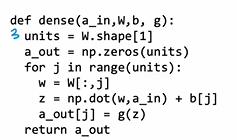
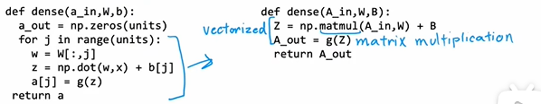
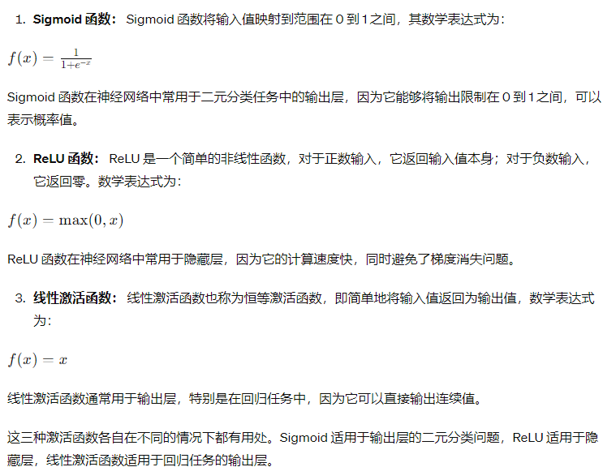

# ML
## 线性回归

wx+b 成本函数 代价函数

线性回归指的是单参数变量

w、b是要定义的系数或者权重

1/2m 2是为了简约，求导消2

平方误差成本函数

梯度下降实际就是不断逼近最小成本，步长就是阿尔法学习率

学习率太小收敛慢，太大发散

梯度下降同步更新要搞出两个temp变量duo'yua

多元线性回归

np.dot 是点积 硬件层面上加速比for快

不迭代可以用法方程（但只能用在线性回归）

线性回归不适合分类是因为：假设不断增加样本量而分界值是0.5会导致有些消极样本变成积极
（直线右移）

## 逻辑回归
逻辑回归实际上是用来分类的，虽然也是用回归来达到目的所以名字是有点迷惑性。

sigmoid 函数是用1/[1+(e^-z)] 实现的

它的损失函数是需要用对数函数来大致获得的。

## 拟合

过拟合 高方差
欠拟合 高偏差

## 神经网络

用到逻辑回归

输入层：就是实际上每个输入的参数的集合，通常层数计算不包括输入层并且为0层。

中间层（隐藏层）：有对应的具体成本函数所输出结果

输出层（激活层）：它将隐藏层的输出转换为最终的预测或分类结果。激活函数通常被应用于激活层中，是需要输出的概率

多层感知器：由多个神经网络层组成，每个层与下一层全连接。它包括输入层、若干个隐藏层和输出层。

卷积：特征提取，先是提取一个3x3的，然后把3x3搞成一个特征，然后再把多个3x3搞成一个特征，所以开始是个小区域，后面就相当于把多个区域的特征合在一起了，所以从小到大

前向传播:就是正常的层数顺序往下，与反向传播形成对比

框架：TensorFlow和Pytorch、sciencekitlearn等，吴恩达的google团队使用的是TensorFlow

# TensorFlow

[]的中括号数量表示几维矩阵，例如[x,y]即为一维矩阵。

`tf.Tensor()`

Tensor是一个数据类型,输出数据，几行几列，以及数据所使用的格式。

例如：`tf.Tensor([[0.2,0.7,0.3]],shape=(1,3),dtype=float32)`

可以用`x.numpy()`将Tensor转换为Numpy数组。

`Sequential()`：串联中间层

## 神经网络搭建通常步骤

1、layer层定义：`layer_x = Dense(units=25,activation="sigmoid")` [原理](#1)

2、模型串联：`model = Sequential([layer_x,…,…]) [原理](#2)

3、`model.compile(loss=BinaryCrossentropy())` [原理](#3)

4、`model.fit(X,Y,epochs=100)` [原理](#4)

实际上是Numpy的点积然后应用sigmoid函数，以此类推地类似计算实现前向传播

Dense需要定义：

shape[0]是行数，shape[1]是列数。

[:, j]将选取该数组的所有行（第一个维度）和第j列（第二个维度）的元素。

g是sigmoid函数

这里可以更快就是dense里用矩阵乘法`np.matmul()`（矢量相乘）代替for循环

指定模型进行推理，多重Dense

用特定损失函数编译模型
BinaryCrossentropy：是二进制交叉熵损失函数，二进制说明0-1分类问题

损失函数有很多，需要用再查，不可能完全记住所有。

fit():反向传播

## 激活函数

ReLU

Sigmoid

线性激活函数

推荐ReLU是因为在成本函数中比sigmoid学习得更快

