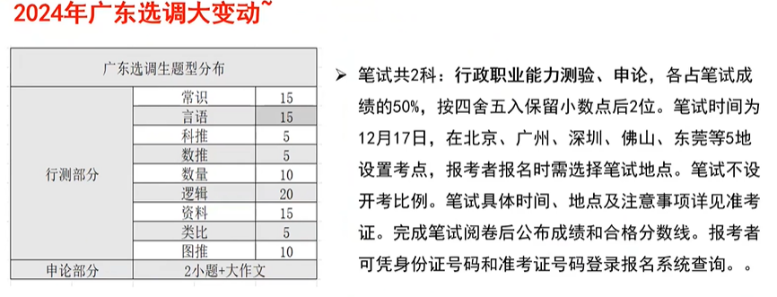
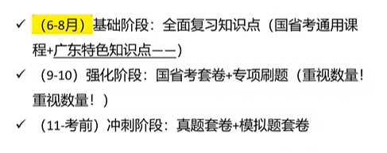

# 公基&行测&条件了解和学习

## 条件

参考24年选调要求，95年11月以后。即研三对应98年以后（报名时满足即可）

24年条件：
必须是党员/获校奖学金以上/优秀学生/担任副班以上职务（满足其一即可）：在本科、研究生就读期间，曾拍任校院系团委书记、副书记、部长、副部长，党、团支部书记、副书记，校院系学生会主席、副主席、部长、副部长，班长、副班长，以及校社团负责人;

1.中大 /华工 /留学生/硕士生无成绩限制（所以3不用看） 
2.暨大 华农 华师 广医 广中医 要求成绩前50%  双一流专业能报高级别岗
3.其他省内上榜学校 成绩要求前50%

三类高校里括号的专业等同于一二类，所以三类括号外和四类无区别。

广选（笔试审核不严格，系统自动审核）

专业不看代码完全看名字

广东选调不区分专硕学硕

表里有对应专业就不能用相似专业

异地不乡镇！！！

常识言语科推数推数量逻辑资料类比图推

有可能结构化面试、也有可能无领导

下乡锻炼两年

## 行测

### 判断推理

#### 位置规律

平移，(旋转、翻转)都属于转动类

#### 样式规律

加减同异

黑白运算：数量相同优先平移，不同则优先黑白运算（黑加白=？的组合运算

#### 属性规律

对称性：中心对称、轴对称

、曲直性、开闭性